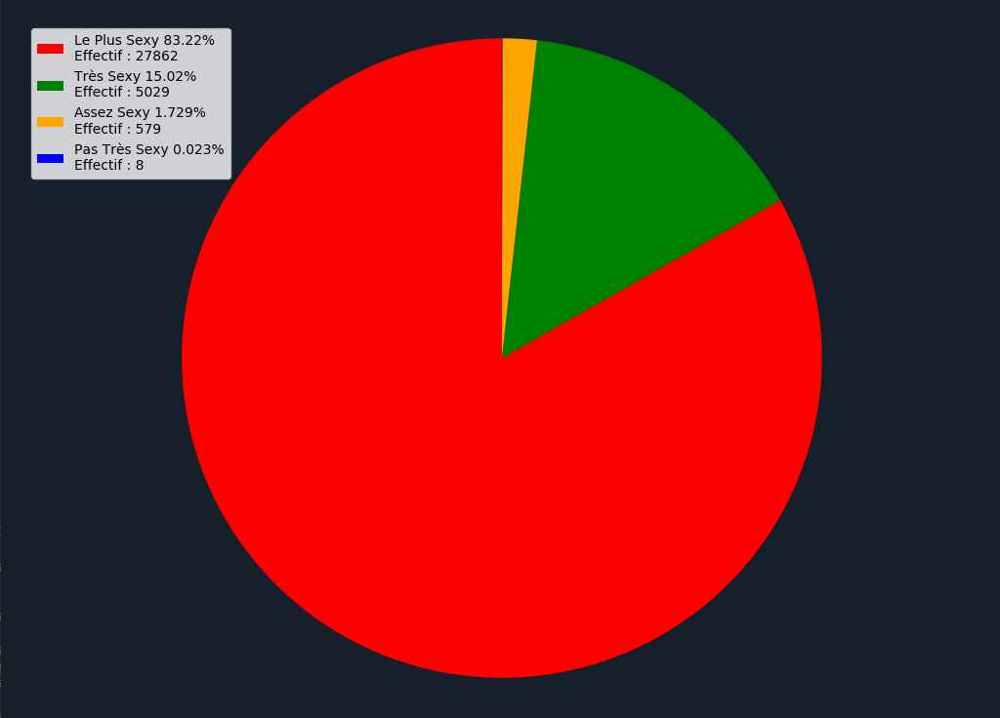

# Astro Debunk

Ce programme en python est celui qui m'a parmi de faire les Statiques à propos de cette image:

## Comment ai-je fais?

Tout d'abord j'ai récupéré les prénoms français enregistré entre 1900 et 2018 sur le [site de l'INSEE](https://www.insee.fr/fr/statistiques/2540004)

Puis ai trié les données afin d'obtenir un total de 33479 prénoms.

Et enfin écrits le programme afin de calculer les points de chacun des prénoms ce qui m'a permi de faire mes statistiques.

